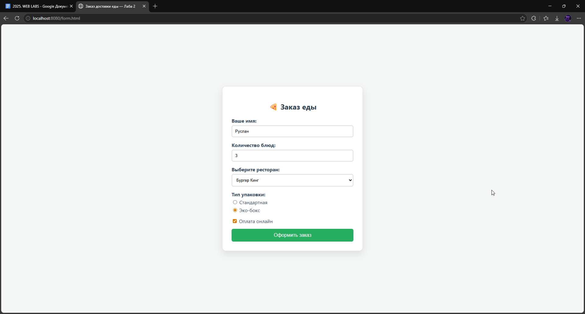
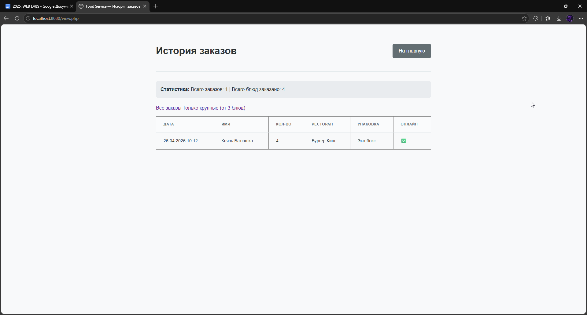

# Лабораторная работа №5: Работа с базой данных MySQL через PHP и Docker

## 📌 Описание задания
- Научиться работать с базой данных MySQL через PHP.
- Создать таблицу для данных формы.
- Сохранять данные формы в базу данных.
- Выводить данные из базы на странице.
- Использовать классы PHP для работы с таблицей.
- Работать с Docker контейнерами: nginx (уже есть), PHP-FPM, MySQL, Adminer.

---

## ⚙️ Как запустить проект

1. Клонировать репозиторий:
   ```bash
   git clone https://github.com/Jasternaut/web_lab_4
   cd web_lab_4
2. Выполнить инициализацию composer:
   ```bash
   cd www
   composer init
   composer require guzzlehttp/guzzle
3. Запустить контейнеры:
   ```bash
   docker-compose up -d --build
   ```
Открыть в браузере:
```http://localhost:8080```

## 📂 Содержимое проекта

```docker-compose.yml``` — описание сервиса Nginx

```Dockerfile``` – установка расширений

```www/index.php``` — главная страница

```www/form.html``` – страница с формой

```www/process.php``` – файл с обработками

```www/view.php``` – вывод заказов

```www/ApiClient.php``` – интеграция api

```www/UserInfo.php``` – сбор данных

```www/OrderRepository.php``` – работа с бд

```www/refresh_api.php``` – управление кешем

```screenshots/``` — все скриншоты

## 📸 Скриншоты работы

</img>
</img>
